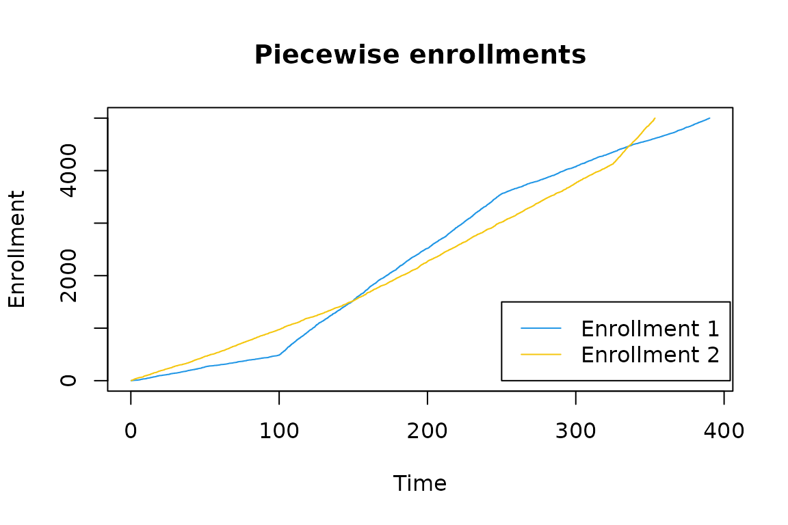
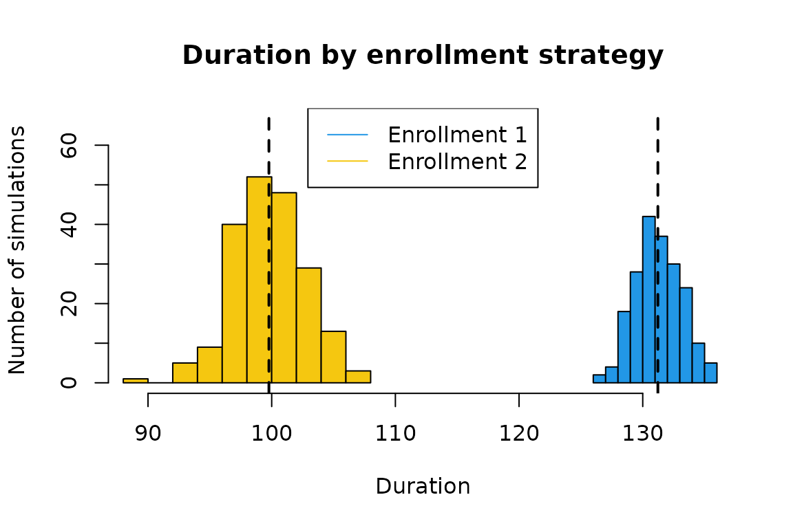

# Simulating time-to-event trials in parallel

## Overview

This vignette demonstrates the ability to implement
[`sim_fixed_n()`](https://merck.github.io/simtrial/reference/sim_fixed_n.md)
using user-defined backends to parallelize simulations. We will consider
the backends supported by the [future](https://future.futureverse.org/)
framework.

The backends supported by the future package include:

- `sequential` - default and non-parallel backend.
- `multisession` - uses multiple background R sessions on a single
  machine.
- `multicore` - uses multiple forked R processes on a single non-Windows
  machine outside of RStudio.
- `cluster` - supports external R sessions across multiple machines.

You can also choose other backend types supported by additional future
extension packages, such as the HPC job scheduler backends from
future.batchtools.

The function
[`sim_fixed_n()`](https://merck.github.io/simtrial/reference/sim_fixed_n.md)
provides a simulation workflow for a two-arm trial with a single
endpoint. We can vary the parameters of the trial using different
functions outlined in the documentation. This function now provides
users the opportunity to implement their simulations using the
previously described parallel backends to accelerate the computation.

The function
[`sim_gs_n()`](https://merck.github.io/simtrial/reference/sim_gs_n.md)
which simulates group sequential designs under a fixed sample size also
supports the use of user-defined backends to parallelize simulations in
a similar manner.

## Background

Without specifying a backend,
[`sim_fixed_n()`](https://merck.github.io/simtrial/reference/sim_fixed_n.md)
will execute sequentially. The sequential execution will run all `n_sim`
iterations within the same process or session of R. In order to execute
in parallel, we must define the environment prior to calling the
function. Setting your seed prior to calling the function will ensure
that the results are reproducible.

Suppose you want to investigate the duration of a trial under two
possible enrollments strategies. Both enrollments are piecewise, but
have varying durations and rates.

``` r
library(simtrial)
library(future)
library(doFuture)
```

``` r
set.seed(1)

n <- 5000
enroll_rate1 <- data.frame(rate = c(5, 20, 10), duration = c(100, 150, 150))
enroll_rate2 <- data.frame(rate = c(10, 15, 30), duration = c(150, 175, 75))
x1 <- rpwexp_enroll(n = n, enroll_rate = enroll_rate1)
x2 <- rpwexp_enroll(n = n, enroll_rate = enroll_rate2)

plot(
  x1, 1:n,
  type = "l",
  col = palette()[4],
  xlim = c(0, max(x1, x2)),
  main = "Piecewise enrollments",
  xlab = "Time",
  ylab = "Enrollment"
)
lines(x2, 1:n, col = palette()[7])
legend(
  250, 1500,
  legend = c("Enrollment 1", "Enrollment 2"),
  col = c(palette()[4], palette()[7]),
  lty = c(1, 1)
)
```



We see that *Enrollment 2* enrolls individuals more quickly than
*Enrollment 1* at onset. Later, *Enrollment 1* will outpace *Enrollment
2* before eventually being overtaken again. As such, we want to consider
how the duration of the study changes under these enrollments.

## The sequential run

Naively, we can execute these simulations sequentially. We set the
target of a total enrollment of 3000 individuals with the trial ending
after observing 700 events. We use `timing_type = 2` to return the
correct trial duration.

*Note:* We manually set the number of threads to be used by {data.table}
operations to 1. This is purely for the sake of comparing the runtime to
the parallel run performed later in this vignette. If you were running
simulations sequentially, you would want {data.table} to take advantage
of parallel processing.

``` r
data.table::setDTthreads(threads = 1)
set.seed(1)

n_sim <- 200

start_sequential <- proc.time()

seq_result1 <- sim_fixed_n(
  n_sim = n_sim,
  sample_size = 3000,
  target_event = 700,
  enroll_rate = enroll_rate1,
  timing_type = 2 # Time until targeted event count achieved
)
#> Backend uses sequential processing.

seq_result2 <- sim_fixed_n(
  n_sim = n_sim,
  sample_size = 3000,
  target_event = 700,
  enroll_rate = enroll_rate2,
  timing_type = 2 # Time until targeted event count achieved
)
#> Backend uses sequential processing.

duration_sequential <- proc.time() - start_sequential
```

A message automatically appears in the console that indicates what
backend is being used for processing.

The calls to [`proc.time()`](https://rdrr.io/r/base/proc.time.html)
allow us to evaluate the computation time of these procedures. This
function provides three outputs, we will focus on user and elapsed time.
User time represents the CPU time spent evaluating the function and
elapsed time represents the “wall clock” time spent by the end user
waiting for the results.

``` r
print(duration_sequential)
#>    user  system elapsed 
#>  10.692   0.062  10.754
```

We can see that the CPU time is 10.69 and the elapsed time is 10.75
seconds. These provide our baseline for the computation time.

As you may have anticipated, we see that for a lower number of events,
enrollment 2 has a shorter average duration of 99.8 over that of
enrollment 1, which is 131.2.



## Setting up a parallel backend

If we increased the number of simulations for each enrollment, we can
expect the time to run our simulations to increase. Furthermore, as we
vary and increase the number of parameter inputs that we consider, we
expect the simulation process to continue to increase in duration. To
help combat the growing computational burden, we can run these
simulations in parallel using the `multisession` backend available to us
in [`plan()`](https://future.futureverse.org/reference/plan.html).

We can adjust the default number of cores with the function
[`parallelly::availableCores()`](https://parallelly.futureverse.org/reference/availableCores.html).
The multisession backend will automatically use all available cores by
default, but here we will use two. To initialize our backend, we change
our plan.

``` r
plan(multisession, workers = 2)
```

## Execution in parallel

Once we have configured the backend details, we can execute the same
code as before to automatically distribute the `n_sim` simulations
across the available cores.

*Note:* We do not have to worry about setting
`data.table::setDTthreads(threads = 1)` for the parallel processes
spawned by
[`sim_fixed_n()`](https://merck.github.io/simtrial/reference/sim_fixed_n.md)
below because {data.table} “automatically switches to single threaded
mode upon fork” (from
[`?data.table::setDTthreads`](https://rdatatable.gitlab.io/data.table/reference/openmp-utils.html)).
[¹](#fn1)

``` r
set.seed(1)

start_parallel <- proc.time()

par_result1 <- sim_fixed_n(
  n_sim = n_sim,
  sample_size = 3000,
  target_event = 700,
  enroll_rate = enroll_rate1,
  timing_type = 2 # Time until targeted event count achieved
)
#> Using 2 cores with backend multisession

par_result2 <- sim_fixed_n(
  n_sim = n_sim,
  sample_size = 3000,
  target_event = 700,
  enroll_rate = enroll_rate2,
  timing_type = 2 # Time until targeted event count achieved
)
#> Using 2 cores with backend multisession

duration_parallel <- proc.time() - start_parallel
```

``` r
print(duration_parallel)
#>    user  system elapsed 
#>   2.278   0.021   9.665
```

We can see that the CPU time is 2.28 and the elapsed time is 9.67
seconds. The user time here appears to be drastically reduced because of
how R keeps track of time; the time used by the parent process and not
the children processes are reported for the user time. Therefore, we
compare the elapsed time to see the real-world impact of the
parallelization.

To change the implementation back to a sequential backend, we simply use
what is below.

``` r
plan(sequential)
```

We can also verify that the simulation results are identical because of
setting a seed and that the backend type will not affect the results.
Below, it is clear that the results from our sequential and multisession
backends match completely.

``` r
all.equal(seq_result1, par_result1)
#> [1] TRUE
all.equal(seq_result2, par_result2)
#> [1] TRUE
```

*Note:* A parallel implementation may not always be faster than a serial
implementation. If there is substantial overhead associated with
executing in parallel, sequential evaluation may be faster. For a low
number of simulations or available cores, it may be preferable to
continue computation in serial rather than parallel. We leave it to the
end user to determine this difference based on the resources available
to them.

## A nested parallel example

We provide an additional example using a nested parallel structure for
users with more extensive resources, such as high-performance computing
clusters, available to them. Because these resources are not commonly
available, we will not execute the below code herein. Consider that you
have two accessible nodes, each with three cores (shown in the diagram
below).


Available resource schematic.

Ideally, all available resources will be used when executing the
simulations. To do this, we need to correctly define our backend using
[`plan()`](https://future.futureverse.org/reference/plan.html) and run
the same code as previously. The different structures, or topologies,
for a backend can be changed with a more in depth explanation given in
the [future topologies
vignette](https://future.futureverse.org/articles/future-3-topologies.html).
Our below example follows closely their example.

In our below snippet, we consider the two nodes named `n1` and `n2` and
create a function to select the number of cores to use on those named
nodes. While trivial here, a courteous user of shared machines would
specify fewer than all available cores and can do such using a
modification of the below code. We then implement our backend using a
list that follows the hierarchy of the available resources.

``` r
nodes <- c("n1", "n2")
custom_cores <- function() {
  switch(Sys.info()[["nodename"]],
    "n1" = 3L, # Modify here for number of cores on node1
    "n2" = 3L, # Modify here for number of cores on node2
    ## Default:
    availableCores()
  )
}
plan(list(
  tweak(cluster, workers = nodes),
  tweak(multisession, workers = custom_cores)
))
```

The function
[`tweak()`](https://future.futureverse.org/reference/plan.html) is
necessary to override the inherent protection of nested parallelism,
meant to help avoid overloading one’s resources by errantly starting too
many processes. Because of the need to tweak backends, the message
echoed to the console for nested backends reflects the highest level of
the nested hierarchy.

With the backend in place, we then can run the identical code from
before using all available resources and return the same results as
before.

``` r
set.seed(1)

enroll_rates <- list(enroll_rate1, enroll_rate2)

nested_result <- foreach::foreach(
  i = 1:2,
  .combine = "list",
  .options.future = list(seed = TRUE)
) %dofuture% {
  sim_fixed_n(
    n_sim = n_sim,
    sample_size = 3000,
    target_event = 700,
    enroll_rate = enroll_rates[[i]],
    timing_type = 2 # Time until targeted event count achieved
  )
}
```

Then, we reset the `plan` to sequential to avoid accidentally continuing
to execute later calls within these resources.

``` r
plan(sequential)
```

------------------------------------------------------------------------

1.  This can get complex quick. The behavior of parallel computing is
    affected by your operating system (e.g. Windows) and editor
    (e.g. RStudio). If you need to perform accurate benchmarking, you
    will need to do your own due diligence. We recommend adding
    `data.table::setDTthreads(threads = 1)` to your `~/.Rprofile` to
    have the best chance of preventing {data.table} multithreading from
    affecting your benchmarking results.
