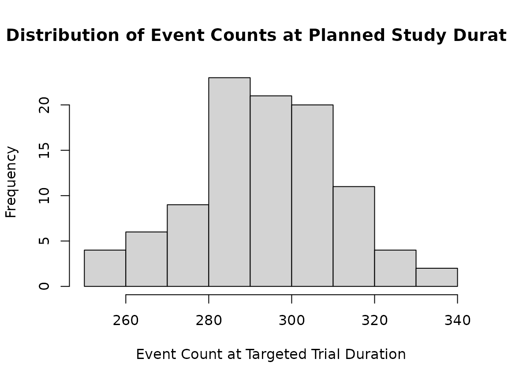

# Simulate Fixed Designs with Ease via sim_fixed_n

``` r
library(gsDesign2)
library(simtrial)
library(dplyr)
library(gt)

set.seed(2027)
```

The
[`sim_fixed_n()`](https://merck.github.io/simtrial/reference/sim_fixed_n.md)
function simulates a two-arm trial with a single endpoint, accounting
for time-varying enrollment, hazard ratios, and failure and dropout
rates.

While there are limitations, there are advantages of calling
[`sim_fixed_n()`](https://merck.github.io/simtrial/reference/sim_fixed_n.md)
directly:

- It is simple, which allows for a single function call to perform an
  arbitrary number of simulations.
- It automatically implements a parallel computating backend to reduce
  running time.
- It offers up to 5 options for determining the data cutoff for analysis
  through the `timing_type` parameter.

If people are interested in more complicated simulations, please refer
to the vignette [Custom Fixed Design Simulations: A Tutorial on Writing
Code from the Ground
Up](https://merck.github.io/simtrial/articles/sim_fixed_design_custom.html).

The process for simulating via
[`sim_fixed_n()`](https://merck.github.io/simtrial/reference/sim_fixed_n.md)
is outlined in Steps 1 to 3 below.

## Step 1: Define design parameters

To run simulations for a fixed design, several design characteristics
may be used. Depending on the data cutoff for analysis option, different
inputs may be required. The following lines of code specify an
unstratified 2-arm trial with equal randomization. The simulation is
repeated 2 times. Enrollment is targeted to last for 12 months at a
constant enrollment rate. The median for the control arm is 10 months,
with a delayed effect during the first 3 months followed by a hazard
ratio of 0.7 thereafter. There is an exponential dropout rate of 0.001
over time.

``` r
n_sim <- 100
total_duration <- 36
stratum <- data.frame(stratum = "All", p = 1)
block <- rep(c("experimental", "control"), 2)

enroll_rate <- data.frame(stratum = "All", rate = 12, duration = 500 / 12)
fail_rate <- data.frame(stratum = "All",
                        duration = c(3, Inf), fail_rate = log(2) / 10, 
                        hr = c(1, 0.6), dropout_rate = 0.001)
```

We specify sample size and targeted event count based on the
[`fixed_design_ahr()`](https://merck.github.io/gsDesign2/reference/fixed_design.html)
function and the above options. The following design computes the sample
size and targeted event counts for 85% power. In this approach, users
can obtain the sample size and targeted events from the output of `x`,
specifically by using `sample_size <- x$analysis$n` and
`target_event <- x$analysis$event`.

``` r
x <- fixed_design_ahr(enroll_rate = enroll_rate, fail_rate = fail_rate, 
                      alpha = 0.025, power = 0.85, ratio = 1, 
                      study_duration = total_duration) |> to_integer()
x |> summary() |> gt() |> 
  tab_header(title = "Sample Size and Targeted Events Based on AHR Method", 
             subtitle = "Fixed Design with 85% Power, One-sided 2.5% Type I error") |>
  fmt_number(columns = c(4, 5, 7), decimals = 2)
```

| Sample Size and Targeted Events Based on AHR Method      |     |        |       |      |          |       |           |
|----------------------------------------------------------|-----|--------|-------|------|----------|-------|-----------|
| Fixed Design with 85% Power, One-sided 2.5% Type I error |     |        |       |      |          |       |           |
| Design                                                   | N   | Events | Time  | AHR  | Bound    | alpha | Power     |
| Average hazard ratio                                     | 516 | 295    | 36.01 | 0.70 | 1.959964 | 0.03  | 0.8504588 |

Now we set the derived targeted sample size, enrollment rate, and event
count from the above.

``` r
sample_size <- x$analysis$n
target_event <- x$analysis$event
enroll_rate <- x$enroll_rate
```

## Step 2: Run `sim_fixed_n()`

Now that we have set up the design characteristics in Step 1, we can
proceed to run `sim_fix_n()` for our simulations. This function
automatically utilizes a parallel computing backend, which helps reduce
the running time.

The `timing_type` specifies one or more of the following cutoffs for
setting the time for analysis:

- `timing_type = 1`: The planned study duration.
- `timing_type = 2`: The time until target event count has been
  observed.
- `timing_type = 3`: The planned minimum follow-up period after
  enrollment completion.
- `timing_type = 4`: The maximum of planned study duration and time to
  observe the targeted event count (i.e., using `timing_type = 1` and
  `timing_type = 2` together).
- `timing_type = 5`: The maximum of time to observe the targeted event
  count and minimum follow-up following enrollment completion (i.e.,
  using `timing_type = 2` and `timing_type = 3` together).

The `rho_gamma` argument is a data frame containing the variables `rho`
and `gamma`, both of which should be greater than or equal to zero, to
specify one Fleming-Harrington weighted log-rank test per row. For
instance, setting `rho = 0` and `gamma = 0` yields the standard
unweighted log-rank test, while `rho = 0 and gamma = 0.5` provides the
weighted Fleming-Harrington (0, 0.5) log-rank test. If you are
interested in tests other than the Fleming-Harrington weighted log-rank
test, please refer to the vignette at [“Articles”/“Simulate fixed/group
sequential designs”/“Custom Fixed Design Simulations: A Tutorial on
Writing Code from the Ground
Up”](https://merck.github.io/simtrial/articles/sim_fixed_design_custom.html).

``` r
sim_res <- sim_fixed_n(
  n_sim = 2, # only use 2 simulations for initial run
  sample_size = sample_size, 
  block = block, 
  stratum = stratum,
  target_event = target_event, 
  total_duration = total_duration,
  enroll_rate = enroll_rate, 
  fail_rate = fail_rate,
  timing_type = 1:5, 
  rho_gamma = data.frame(rho = 0, gamma = 0))
```

The output of `sim_fixed_n` is a data frame with one row per simulated
dataset per cutoff specified in `timing_type`, per test statistic
specified in `rho_gamma`. Here we have just run 2 simulated trials and
see how the different cutoffs vary for the 2 trial instances.

``` r
sim_res |>
  gt() |>
  tab_header("Tests for Each Simulation Result", subtitle = "Logrank Test for Different Analysis Cutoffs") |>
  fmt_number(columns = c(4, 5, 7), decimals = 2)
```

| Tests for Each Simulation Result            |                    |           |      |      |       |       |                                  |          |     |
|---------------------------------------------|--------------------|-----------|------|------|-------|-------|----------------------------------|----------|-----|
| Logrank Test for Different Analysis Cutoffs |                    |           |      |      |       |       |                                  |          |     |
| method                                      | parameter          | estimate  | se   | z    | event | ln_hr | cut                              | duration | sim |
| WLR                                         | FH(rho=0, gamma=0) | -31.52010 | 8.38 | 3.76 | 287   | −0.45 | Planned duration                 | 36.00000 | 1   |
| WLR                                         | FH(rho=0, gamma=0) | -32.12426 | 8.49 | 3.78 | 295   | −0.45 | Targeted events                  | 36.66316 | 1   |
| WLR                                         | FH(rho=0, gamma=0) | -29.13247 | 8.25 | 3.53 | 278   | −0.43 | Minimum follow-up                | 35.20859 | 1   |
| WLR                                         | FH(rho=0, gamma=0) | -32.12426 | 8.49 | 3.78 | 295   | −0.45 | Max(planned duration, event cut) | 36.66316 | 1   |
| WLR                                         | FH(rho=0, gamma=0) | -32.12426 | 8.49 | 3.78 | 295   | −0.45 | Max(min follow-up, event cut)    | 36.66316 | 1   |
| WLR                                         | FH(rho=0, gamma=0) | -31.88270 | 8.00 | 3.99 | 268   | −0.50 | Planned duration                 | 36.00000 | 2   |
| WLR                                         | FH(rho=0, gamma=0) | -38.09785 | 8.40 | 4.54 | 295   | −0.54 | Targeted events                  | 38.32488 | 2   |
| WLR                                         | FH(rho=0, gamma=0) | -34.29092 | 8.23 | 4.17 | 283   | −0.51 | Minimum follow-up                | 37.47843 | 2   |
| WLR                                         | FH(rho=0, gamma=0) | -38.09785 | 8.40 | 4.54 | 295   | −0.54 | Max(planned duration, event cut) | 38.32488 | 2   |
| WLR                                         | FH(rho=0, gamma=0) | -38.09785 | 8.40 | 4.54 | 295   | −0.54 | Max(min follow-up, event cut)    | 38.32488 | 2   |

## Step 3: Summarize simulations

Now we run 100 simulated trials and summarize the results by how data is
cutoff for analysis.

``` r
sim_res <- sim_fixed_n(
  n_sim = n_sim,
  sample_size = sample_size, 
  block = block, stratum = stratum,
  target_event = target_event, 
  total_duration = total_duration,
  enroll_rate = enroll_rate, 
  fail_rate = fail_rate,
  timing_type = 1:5, 
  rho_gamma = data.frame(rho = 0, gamma = 0))
```

With the 100 simulations provided, users can summarize the simulated
power and compare it to the targeted 85% power. All cutoff methods
approximate the targeted power well and have a similar average duration
and mean number of events.

``` r
sim_res |>
  group_by(cut) |>
  summarize(`Simulated Power` = mean(z > qnorm(1 - 0.025)), 
            `Mean events` = mean(event),
            `Mean duration` = mean(duration)) |>
  mutate(`Sample size` = sample_size,
         `Targeted events` = target_event) |>
  gt() |>
  tab_header(title = "Summary of 100 simulations by 5 different analysis cutoff methods",
             subtitle = "Tested by logrank") |>
  fmt_number(columns = c(2:4), decimals = 2)
```

| Summary of 100 simulations by 5 different analysis cutoff methods |                 |             |               |             |                 |
|-------------------------------------------------------------------|-----------------|-------------|---------------|-------------|-----------------|
| Tested by logrank                                                 |                 |             |               |             |                 |
| cut                                                               | Simulated Power | Mean events | Mean duration | Sample size | Targeted events |
| Max(min follow-up, event cut)                                     | 0.85            | 299.35      | 36.39         | 516         | 295             |
| Max(planned duration, event cut)                                  | 0.85            | 301.54      | 36.59         | 516         | 295             |
| Minimum follow-up                                                 | 0.84            | 291.57      | 35.78         | 516         | 295             |
| Planned duration                                                  | 0.84            | 294.74      | 36.00         | 516         | 295             |
| Targeted events                                                   | 0.85            | 295.00      | 36.00         | 516         | 295             |

We can also do things like summarize distribution of event counts at the
planned study duration. We can see the event count varies a fair amount.

``` r
hist(sim_res$event[sim_res$cut == "Planned duration"], 
     breaks = 10,
     main = "Distribution of Event Counts at Planned Study Duration",
     xlab = "Event Count at Targeted Trial Duration")
```



We also evaluate the distribution of the trial duration when analysis is
performed when the targeted events are achieved.

``` r
plot(density(sim_res$duration[sim_res$cut == "Targeted events"]), 
     main = "Trial Duration Smoothed Density",
     xlab = "Trial duration when Targeted Event Count is Observed")
```


