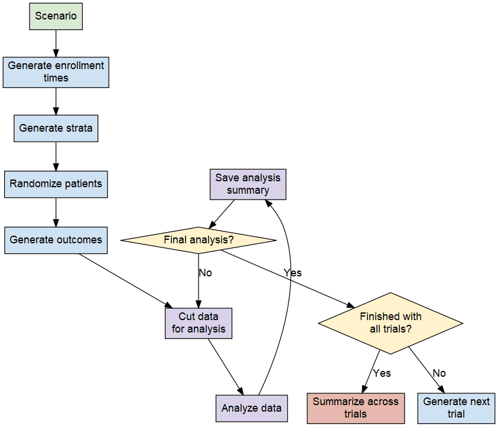

```{r, include=FALSE}
knitr::opts_chunk$set(
  collapse = TRUE,
  comment = "#>"
)
```

## Overview

We attempt to provide a big picture view of what is involved in a clinical trial
simulation with individual time-to-event data generated for each patient.
Primary interest is in group sequential trials, usually with a single endpoint.
However extensions could be made.

## Results data table

At the time of simulation planning an analysis plan for the trial is needed.
For a group sequential design, a data table to store results is generated.
Generally, the dimensions and variables planned for storage would be
planned up front. As a simple example, if there is a group sequential design
with 3 analyses planned, 15 data items for each analysis and 10,000 simulations
planned, a data table with 30,000 rows and 15 columns has been used to store
summary results. As each trial simulation proceeds, a row is updated with
results for each analysis.

## Simulated trial dataset generation

For each simulated trial, an initial table is generated with information at a
patient level. If trials are generated sequentially, the space needed for this
data table could be re-used, never requiring allocation of more space.
Each row contains data for a single patient. As an example, we could simulate
a trial with 500 patients and 10 data items per patients.
The data items would be in columns, the patients in rows.

## Dataset manipulations for analysis

Simulated trial data need to be manipulated to do any individual analysis
(interim or final) for a clinical trial. The following operations are needed:

1. Ordering data
1. Selecting a subset for analysis
1. Calculating individual patient results for the subset at the time of analysis.
1. Performing statistical tests and computing treatment effect estimates
   as well as other summaries that will included in the results summary dataset
   described above. Types of computations needed are
   1. Number of subjects by treatment group
   1. Number of events by treatment group
   1. Kaplan-Meier estimation of survival curves
   1. Observed minus expected computations as well as weighting for logrank, weighted logrank calculations.
   1. Using the survival package to compute hazard ratio estimates.

## Flow for simulating group sequential: one scenario algorithm

Group sequential design simulation flow:

- Generate a trial.
- Analyze repeatedly.
- Summarize across simulated trials.

```{r, echo=FALSE, fig.align="center", out.width="85%"}

```

```{r, echo=FALSE, eval=FALSE}
g <- DiagrammeR::grViz("
digraph boxes_and_diamonds {

  # a 'graph' statement
  graph [ordering = 'in']

  # several 'node' statements
  node [fontsize = '14', fontname = 'Arial']

  node [shape = box, style = filled, fillcolor = '#d9d2e9'] 'Save analysis\n summary'; 'Cut data\n for analysis'; 'Analyze data';

  node [shape = diamond, style = filled, fillcolor = '#fff2cc'] 'Final analysis?'
  node [shape = diamond, style = filled, fillcolor = '#fff2cc'] 'Finished with\n all trials?'

  node [shape = box, style = filled, fillcolor = '#e6b8af', label = 'Summarize across\n trials'] summarize

  node [shape = box, style = filled, fillcolor = '#d9ead3', label = 'Scenario'] scenario
  node [shape = box, style = filled, fillcolor = '#cfe2f3', label = 'Generate enrollment\n times'] enrollment
  node [shape = box, style = filled, fillcolor = '#cfe2f3', label = 'Generate strata'] strata
  node [shape = box, style = filled, fillcolor = '#cfe2f3', label = 'Randomize patients'] randomize
  node [shape = box, style = filled, fillcolor = '#cfe2f3', label = 'Generate outcomes'] outcomes
  node [shape = box, style = filled, fillcolor = '#cfe2f3', label = 'Generate next\n trial'] next

  scenario -> enrollment -> strata -> randomize -> outcomes
  outcomes -> 'Cut data\n for analysis' -> 'Analyze data'->'Save analysis\n summary'
  'Save analysis\n summary' -> 'Final analysis?'
  'Final analysis?' -> 'Cut data\n for analysis' [label = 'No', fontname = 'Arial']
  'Final analysis?' -> 'Finished with\n all trials?' [label = 'Yes', fontname = 'Arial']
  'Finished with\n all trials?' -> summarize [label = 'Yes', fontname = 'Arial']
  'Finished with\n all trials?' -> next [label = 'No', fontname = 'Arial']
}
")

rsvg::rsvg_png(charToRaw(DiagrammeRsvg::export_svg(g)), file = file.path(tempdir(), "workflow.png"))
```
